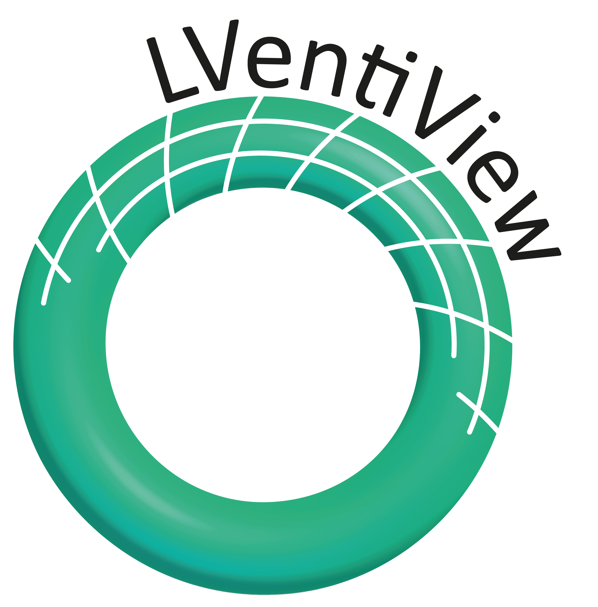
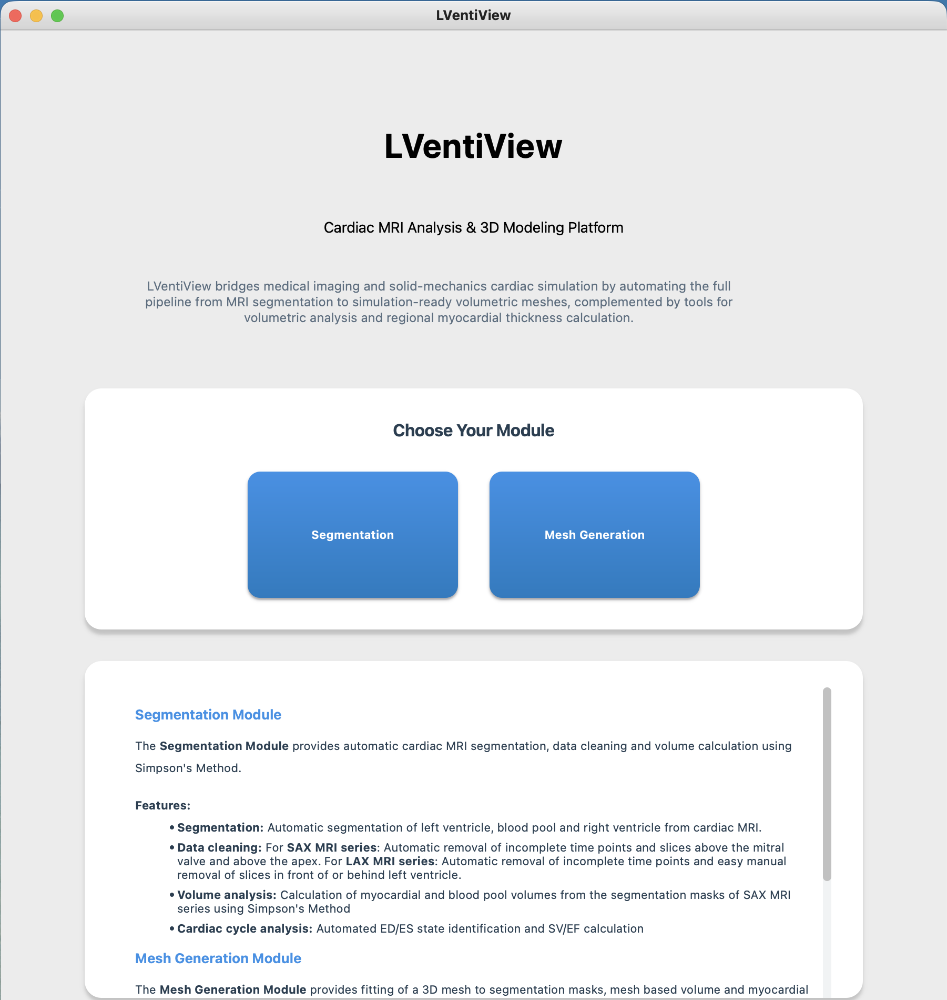
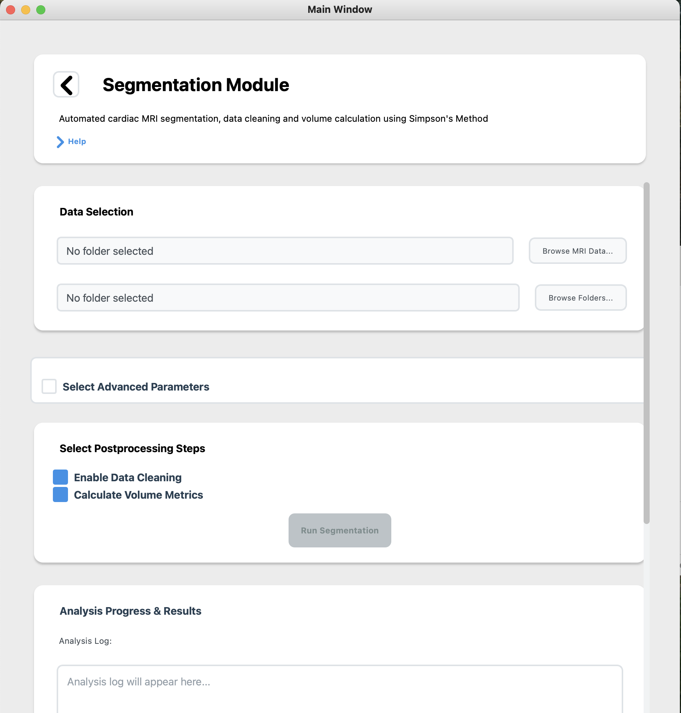
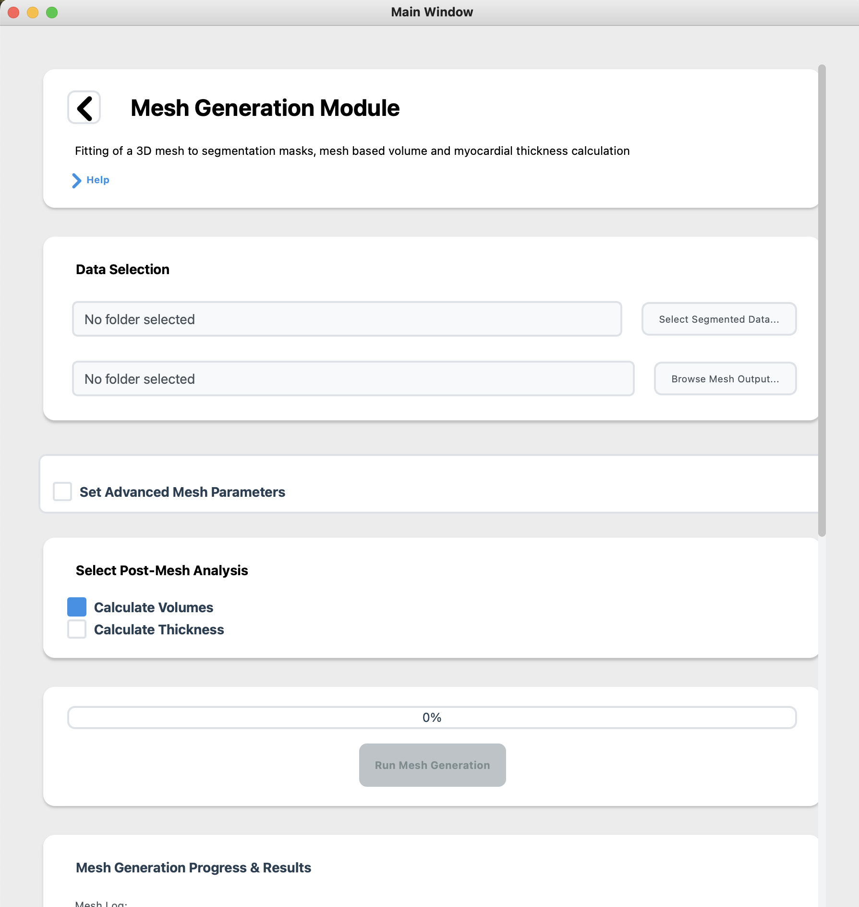

<div align="center">


  
  <h1>LVentiView</h1>
  
  <p>
    Read Me 
  </p>
  
  
<!-- Badges -->
<p>
  <a href="https://github.com/InaBraun01/LVentiView/graphs/contributors">
    
  </a>
  <a href="">
    
  </a>
  <a href="https://github.com/InaBraun01/LVentiView/network/members">
    
  </a>
  <a href="https://github.com/InaBraun01/LVentiView/stargazers">
    
  </a>
  <a href="https://github.com/InaBraun01/LVentiView/issues/">
    
  </a>
  <a href="https://github.com/InaBraun01/LVentiView/blob/master/LICENSE">
    
  </a>
</p>
   
<h4>
    <a href="https://github.com/InaBraun01/LVentiView/issues/">Report Bug</a>
  <span> · </span>
    <a href="https://github.com/InaBraun01/LVentiView/issues/">Request Feature</a>
  </h4>
</div>

<br />

<!-- Table of Contents -->
# Table of Contents

- [About the Project](#about-the-project)
- [About the Software](#about-the-software)
- [Getting Started](#getting-started)
  * [Python Virtual Environment](#python-virtual-environment)
- [Launching the GUI from the terminal](#launching-the-GUI-from-the-terminal)
  * [Start Page](#start-page)
  * [Segmentation Module](#segmentation-module)
  * [Mesh Generation Module](#mesh-generation-module)
- [Running LVentiView from the Terminal](#running-lventiview-from-the-terminal)
- [Contributing](#contributing)
- [License](#license)
- [Contact](#contact)
- [Acknowledgements](#acknowledgements)
  

<!-- About the Project -->
## About the Project
Accurate quantification of left ventricular cavity volume (LVV) and ejection fraction (EF) from cardiac magnetic resonance imaging (MRI) is essential for diagnosis and prognosis in cardiovascular care. However, current clinical methods for calculating EF are subject to substantial measurement uncertainty, primarily due to variability in manual segmentation, the use of basic geometric assumptions for interpolation between acquired 2D MRI slices and sampeling the entire extent of the LV. To address these challenges, LVentiView, an open-source Python platform with a graphical user interface, was developed. The platform integrates automated MRI segmentation, three-dimensional (3D) mesh generation, volumetric analysis, and regional myocardial thickness calculation. Accuracy of the volume calculation was assessed using an idealized left ventricular geometry with known ground-truth volumes. The software was further evaluated on clinical cardiac MRI datasets. LVentiView successfully performed automated segmentation and mesh-based 3D reconstruction, enabling accurate quantification of LVV and regional wall thickness for both an idealized geometry and clinical MRI datasets. By combining automation with an intuitive interface, LVentiView provides a user-friendly tool for quantifying LVV, EF, and regional myocardial thickness. It is designed with potential for integration into clinical practice.

<!-- About the Software -->
## About the Software
LVentiView is organized into two main modules: the Segmentation module and the Mesh Generation module. The software can be used either through a graphical user interface (GUI) or directly from the terminal. Regardless of the interface, the inputs and outputs remain identical.

## Getting Started
To use either the graphical user interface (GUI) or the code directly from the terminal, simply download the current release of LVentiView [software package](https://github.com/InaBraun01/LVentiView/releases/tag/v1.0) and follow the instructions below. 

1. Download the current release [software package](https://github.com/InaBraun01/LVentiView/releases/tag/v1.0)
2. In the downloaded folder containing the code (LVentiView), create a new folder called (SegmentationModels)
3. Move the downloaded files containing NN weights (pytorch_my_LAX_Model.pth and pytorch_my_model.pth) into the folder SegmentationModels
4. Continue with setting up the python virtual environment needed


### Python Virtual Environment
The first step to using LVentiView is to set up a python virtual environment as described below. If you are more comfortable working with a conda environment that is ofcourse also possible just install the same dependencies as listed down below. 

1. **Create and activate a python virtual environment**:

```bash
python3 -m venv ~/lventiview_env
source ~/lventiview_env/bin/activate
```

2. **Upgrade pip**:
```bash
pip install --upgrade pip
```

3. **Install required Python packages:**
```bash
pip install numpy==1.23.5 \
            pyvista==0.42.3 \
            scipy==1.10.1 \
            pydicom==2.4.4 \
            meshio==5.3.5 \
            tqdm==4.66.4 \
            imageio==2.33.1 \
            scikit-image==0.19.3 \
            torch torchvision torchaudio \
            pandas==2.0.3 \
            seaborn==0.13.2 \
            onnx2torch==1.5.15 \
            PyQt5==5.15.10
```

4. **Activate the Python virtual environment**:
```bash
source ~/lventiview_env/bin/activate
```

Now you can either launche the GUI from the terminal and work with the graphical user interphase or you can continue to run the software from the terminal.

## Launching the GUI from the terminal
First make sure that you have created and activated the python environment as described above. Next you can simply open the GUI by running 
1. **Open the GUI**:
```bash
  python LVentiView.py
```
This opens the start page of the GUI from which you can navigate to the pages of the **Segmentation Module** as well as the **Mesh Generation Module** .

---
### Start Page
On the **Start Page**, you’ll find an overview of the user interface along with descriptions of all parameters that can be configured manually.  
From here, you can also navigate directly to the two main modules of **LVentiView**:  
- **Segmentation Module**  
- **Mesh Generation Module**  

<div align="center"> 
  
</div>


### Segmentation Module
The **Segmentation Module** processes cardiac MRI series with a single click.  
Users simply choose an input folder and an output directory, then start segmentation by pressing the **Run Segmentation** button in the GUI.

By default, two post-processing steps are applied:  
- **Data cleaning**: removes incomplete time points and slices outside the mitral valve–apex range.  
- **Volume analysis**: calculates myocardial and blood pool volumes, identifies ED/ES states, and plots volume curves.  

The workflow is fully automated but can be customized by adjusting thresholds, enabling/disabling steps, or performing manual cleaning in the GUI.  

<div align="center"> 
  
</div>

### Mesh Generation Module
The **Mesh Generation Module** constructs a 3D LV model from segmented MRI data and provides LVV, EF, and myocardial thickness quantification.  

In the default workflow, users select a folder with segmentation data (.pkl) and an output directory. The fitting process is started by pressing the **Run Mesh Fitting** button in the GUI (or via the terminal). The software then builds one volumetric mesh per MRI time step, saved in `.vtk` format, along with visualizations and Dice scores assessing mesh quality.  

Two post-processing steps are included:  
- **Volume analysis**: computes myocardial and blood pool volumes, identifies ED/ES states, and plots them over the cardiac cycle.  
- **Thickness mapping**: generates local myocardial thickness maps for each time point.  

The workflow is automated but fully configurable—users can adjust fitting parameters, restrict fitting to selected time steps, and enable/disable analysis options.  

<div align="center"> 
  
</div>

---

<!-- Running LVentiView from the Terminal -->
## Running LVentiView from the Terminal
You can also run the software via the terminal without a graphical-user interphase. To do this you first need to make sure that you set up the python environment as described above and that you have activated the python environment. The you can follow the following steps to use the **Segmentation** and **Mesh Generation modules** from the terminal.
1. **Specify the input and output folders**:
Open the ```Main.py``` file and set:
- The path to the folder containing your MRI images.
- The output folder where the results will be saved.

3. **Run the workflows**:
- **Segmentation only**:
```bash
python Main.py segmentation
```
- **Mesh Generation only**:
```bash
python Main.py meshing
```
- **Both workflows sequentially** (Segmentation -> Mesh Generation):
```bash
python Main.py 
```

<!-- Contributing -->
## Contributing
Contributions are welcome! If you’d like to improve LVentiView, feel free to fork the repo, make changes, and submit a pull request.


<!-- Contact -->
## Contact

Ina Braun - ina.braun@ds.mpg.de

Project Link: [https://github.com/InaBraun01/LVentiView.git](https://github.com/InaBraun01/LVentiView.git)


<!-- Acknowledgments -->
## Acknowledgements
Thanks to Louis3797 for the nice Read Me file template ([https://github.com/Louis3797/awesome-readme-template.git](https://github.com/Louis3797/awesome-readme-template.git)).
